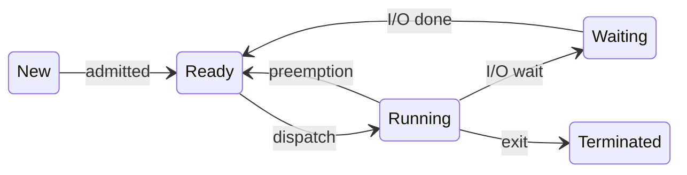

import StepFlow from '../../../../../components/StepFlow.astro';

## 핵심 개념

프로세스는 생성부터 종료까지 **5가지 상태** 중 하나에 있다.

| 상태 | 설명 |
|------|------|
| **New** | 프로세스가 생성되는 중 |
| **Ready** | CPU를 받으면 바로 실행할 수 있는 상태 (메모리에 있음) |
| **Running** | CPU를 점유하여 명령어를 실행 중 |
| **Waiting** | I/O 완료 등 특정 이벤트를 기다리는 상태 |
| **Terminated** | 실행이 끝나고 정리 중 |

## 동작 원리

### 상태 전이 정리

| 전이 | 조건 | 설명 |
|------|------|------|
| New → Ready | admitted | OS가 프로세스를 승인하고 메모리에 적재 |
| Ready → Running | scheduler dispatch | 스케줄러가 이 프로세스에 CPU 할당 |
| Running → Ready | interrupt / preemption | 타임 슬라이스 만료 또는 더 높은 우선순위 프로세스 등장 |
| Running → Waiting | I/O or event wait | I/O 요청, 자원 대기 등 |
| Waiting → Ready | I/O complete | I/O가 완료되어 다시 CPU를 받을 준비 |
| Running → Terminated | exit | 실행 완료 또는 강제 종료 |

### 주의: Running은 한 번에 하나

단일 코어 CPU에서는 **Running 상태인 프로세스는 최대 1개**이다. 멀티코어라면 코어 수만큼 Running이 가능하다. 반면 Ready와 Waiting에는 여러 프로세스가 동시에 있을 수 있다 (큐로 관리).

## 예시

웹 브라우저 프로세스의 상태 변화:

<StepFlow
  steps={[
    { label: "New", description: "브라우저 실행" },
    { label: "Ready", description: "메모리 적재 완료" },
    { label: "Running", description: "화면 렌더링" },
    { label: "Waiting", description: "네트워크 응답 대기" },
    { label: "Ready", description: "데이터 도착" },
    { label: "Running", description: "데이터 처리" },
    { label: "Terminated", description: "브라우저 종료" }
  ]}
/>

## 관련 개념

- [프로세스 (Process)](/knowledge/os/process/) - 프로세스의 기본 개념
- [프로세스 제어 블록 (PCB)](/knowledge/os/pcb/) - 프로세스 상태 정보를 저장하는 자료구조
- [컨텍스트 스위치](/knowledge/os/context-switch/) - Running 프로세스가 바뀔 때 발생하는 전환 과정
